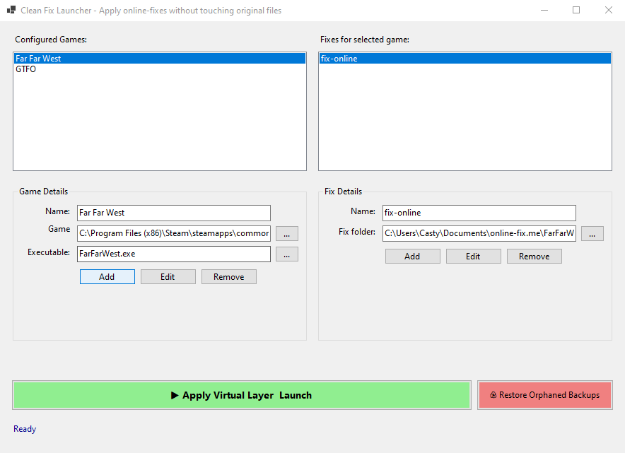

# Clean Fix Launcher – One‑click online‑fix overlay for Steam games

> **⚠️ Disclaimer: This project was written with AI (GitHub Copilot / ChatGPT).**  
> It is **not** a professional or serious tool. It was created for personal use and for a small group of friends who wanted a quick way to apply **online-fixes** to Steam games without touching the original installation.

## Why this exists

I buy games on Steam, but sometimes I want to apply a “fix” (a crack, an online‑fix) to play with friends.  
Every time I want to use the fix, I have to manually copy files into the game folder, overwriting the originals. Then, to go back to the legit Steam version, I have to restore those files by hand. This back‑and‑forth is tedious and error‑prone.

No existing tool made this easy. So I built a launcher that:

- Keeps the original game folder completely untouched.
- Applies the fix temporarily at launch – no permanent changes.
- Works with any game, any fix folder structure.

## What this tool does

- Lets you launch a game with an online‑fix active, without manually copying or overwriting any files.  
- While the game runs, the fix files overlay the original ones (via symbolic links).  
- When you close the game, it automatically restores the original files.

## Why not just use an existing mod manager?

Most mod managers are designed for **specific games** or expect **hardcoded folder names** (`Mods/`, `plugins/`, etc.). They fail when a fix replaces the main `.exe` or core `.dll` – which is exactly what online‑fixes do.

**Clean Fix Launcher doesn't care what game it is.**  
It just takes your game folder and your fix folder (same relative structure) and overlays the fix at runtime. Works for any game, any fix, any folder layout.

## Screenshot

## Requirements

- Windows (tested on 10/11)
- **Run as Administrator** (required for symbolic links)

## How to use

1. **Add a game** – enter a name and select the game folder (where the `.exe` is). Optionally pick the executable.
2. **Add a fix** – enter a name and select the fix folder (must have the **exact same internal structure** as the game folder).
3. **Select a fix** from the list and click `▶ Apply Virtual Layer & Launch`.
4. The game starts with the fix active. When you close it, original files are restored automatically.
5. If your PC crashes while the fix was active, use `♻ Restore Orphaned Backups` to recover the original files.

**Important:** To play the unmodified Steam version, just launch the game normally (Steam, desktop shortcut, original .exe). This tool only launches with the fix.

All data is saved in `%AppData%\CleanFixLauncher\config.json`.

## Limitations

- Requires administrator rights (symlinks need it).
- The fix folder must mirror the game's exact folder structure.
- While the fix is active, original files are moved to `%TEMP%` (not copied) – necessary because Windows can't have a symlink where a real file exists.

## No warranty

This tool deletes symlinks and moves files. It worked for us, but use at your own risk. Always keep backups of important game files.

---

*Made for fun, by a human + AI, for a very specific use case.*
